# Jersey Hub

A responsive football jersey e-commerce website built with **HTML, CSS, and JavaScript**. It includes product filtering, size selection, product details, cart management, and responsive layouts for desktop and mobile devices.

[**View Live Website**](https://arafat-rahman-lisan.github.io/Jersey_Website/)

## Key Features

- Search and filter jerseys by type
- Product details and size selection
- Add-to-cart and buy-now actions
- Interactive cart with quantity controls
- Size chart, footer links, and newsletter section
- Fully responsive desktop and mobile design

## Desktop / Laptop View

| Product Catalogue | Product Collection |
|---|---|
| 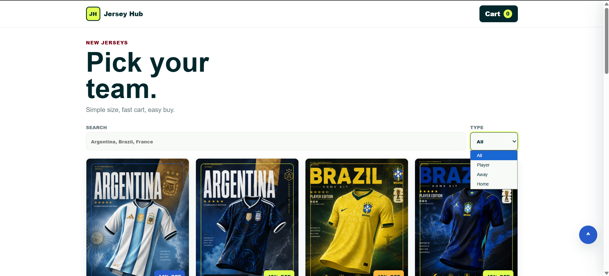 | 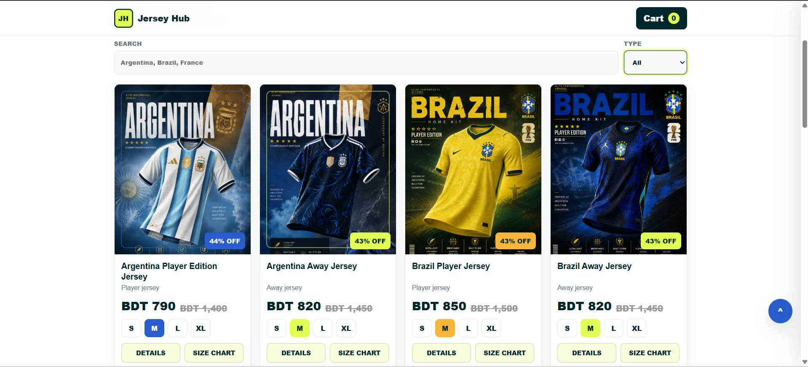 |

| More Jersey Collections | Product Actions |
|---|---|
| 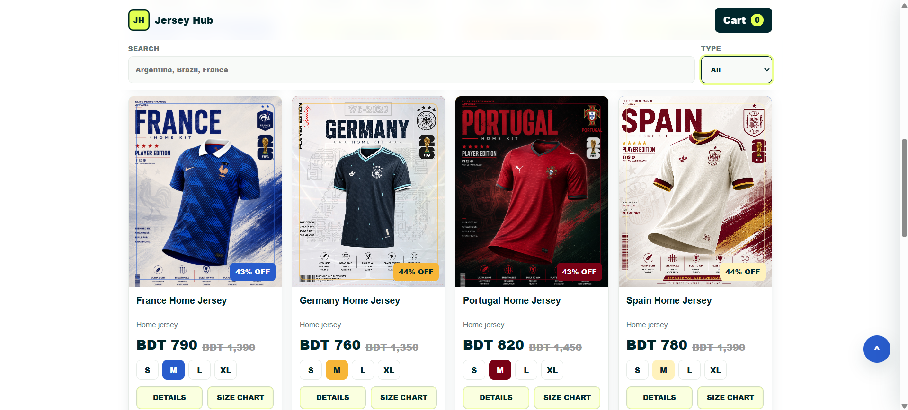 | 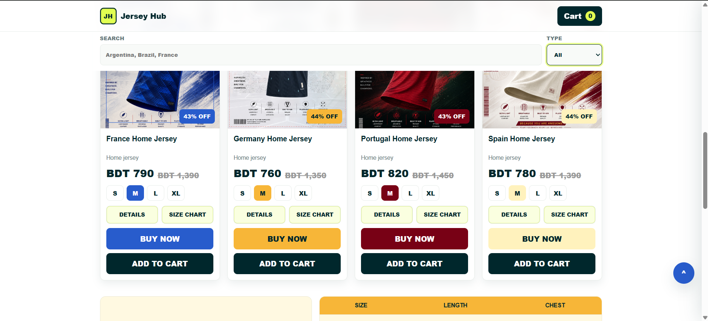 |

| Size Guide | Footer |
|---|---|
| 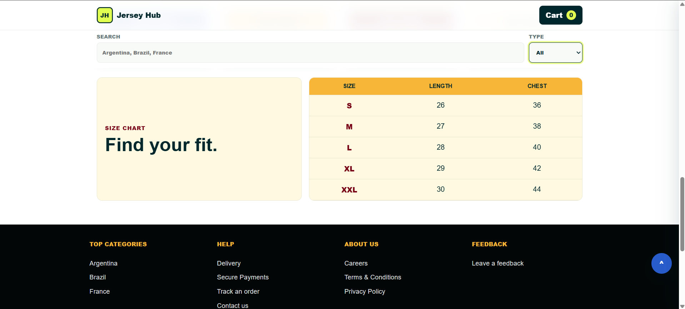 | 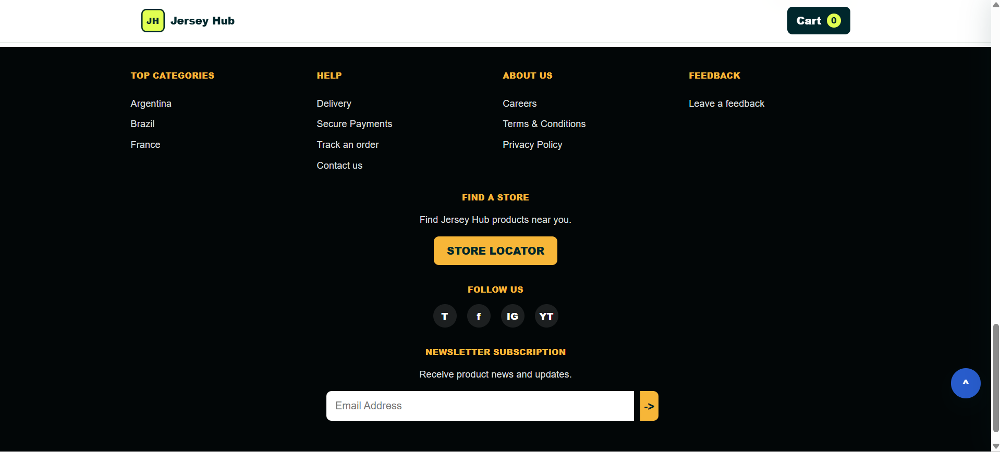 |

| Product Details | Shopping Cart |
|---|---|
| 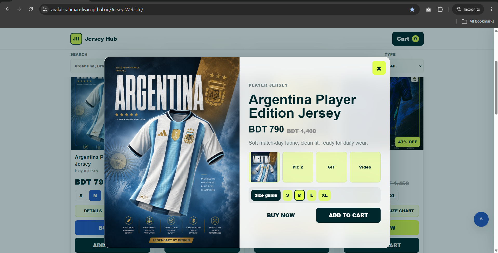 | 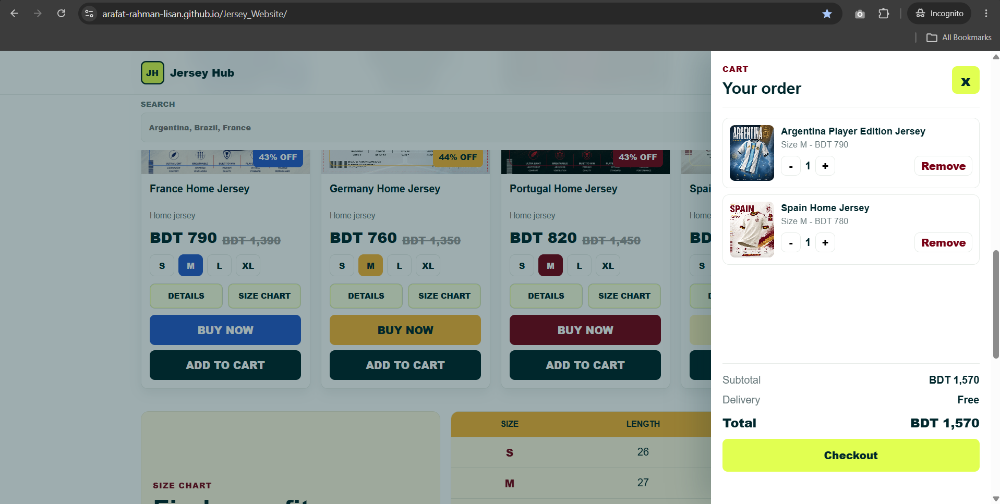 |

## Mobile View

| Mobile Catalogue | Product Cards |
|---|---|
| 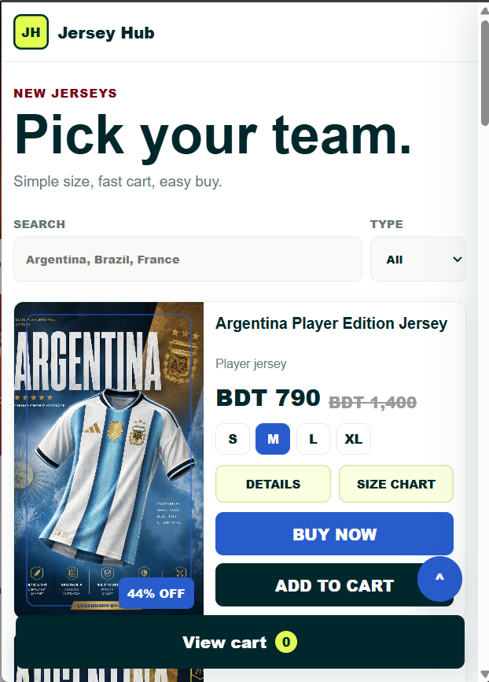 | 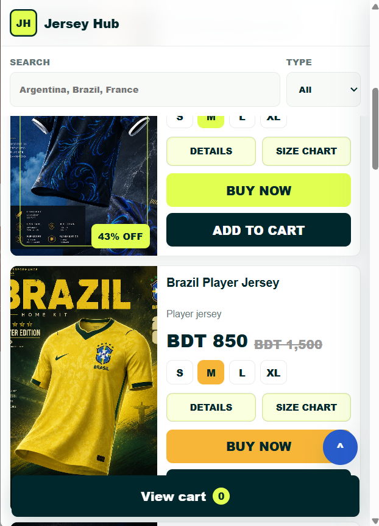 |

| Size Guide | Shopping Cart |
|---|---|
| 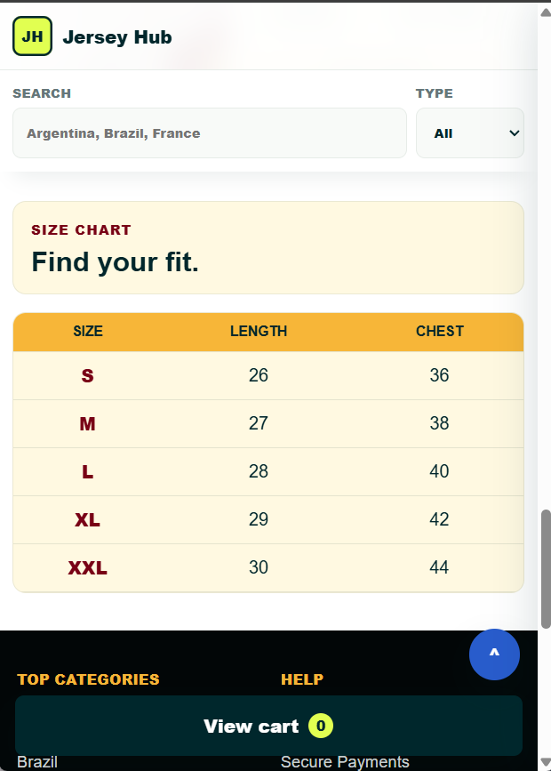 | 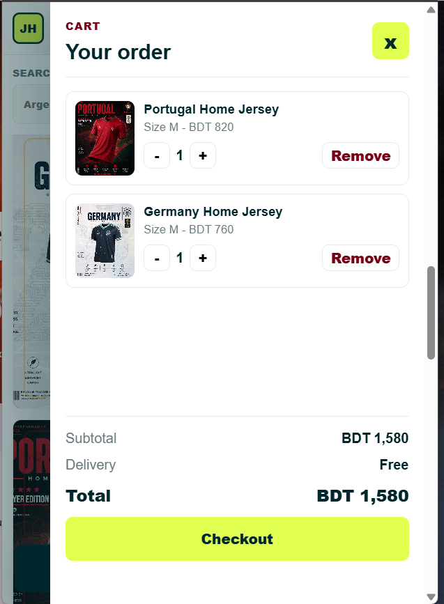 |

## Technologies

`HTML5` · `CSS3` · `JavaScript` · `GitHub Pages`

## Project Structure

```text
Jersey_Website/
├── css/
├── img/
├── js/
├── screenshots/
├── index.html
├── script.js
├── style.css
└── README.md
```

## Run Locally

```bash
git clone https://github.com/arafat-rahman-lisan/Jersey_Website.git
cd Jersey_Website
```

Open `index.html` in your browser.

## Author

**Arafat Rahman Lisan**
